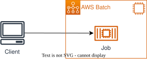

# AWS Batch ECS on GPU Sample


[参考にしたWorkShop](https://catalog.workshops.aws/aws-batch-deep-dive/en-US)

## ハンズオンのコンテンツ

| No  | Job                                                                                                                 | 説明                                                                                     |
| --- | ------------------------------------------------------------------------------------------------------------------- | ---------------------------------------------------------------------------------------- |
| 1   | [Single job](https://catalog.workshops.aws/aws-batch-deep-dive/en-US/05-run-batch-jobs/51-single)                   | 単一のJob実行について学ぶ。                                                              |
| 2   | [Array Job](https://catalog.workshops.aws/aws-batch-deep-dive/en-US/05-run-batch-jobs/52-array)                     | 配列Jobについて学ぶ。                                                                    |
| 3   | [Multi-node parallel Job](https://catalog.workshops.aws/aws-batch-deep-dive/en-US/05-run-batch-jobs/53-mnp)         | 複数のインスタンス上（マルチノード）で実行するジョブについて学ぶ。                       |
| 4   | [Jobs With dependencies](https://catalog.workshops.aws/aws-batch-deep-dive/en-US/05-run-batch-jobs/54-dependencies) | Job間で依存関係があるケースについて学ぶ。                                                |
| 5   | [Jobs With dependencies (EC2 Spot)](https://catalog.workshops.aws/aws-batch-deep-dive/en-US/06-ec2-spot)            | Spotインスタンスの利用方法について学ぶ。実態はNo.4の一部がSpotインスタンスになったもの。 |


## ディレクトリ構成

```sh
.
├── README.md
├── bin
│   └── workshop_batch.ts
├── cdk.json
├── lib
│   ├── constructs
│   │   ├── ap  # コンテナ資材を格納
│   │   ├── ecs-ec2-batch.ts  # ECS on EC2によるAWS Batchの実装（Workshopのメイン）
│   │   └── network.ts  # ネットワーク（VPC）を定義
│   └── workshop_batch-stack.ts
├── package-lock.json
├── package.json
├── test
│   └── workshop_batch.test.ts
└── tsconfig.json

```


## 実行方法

### 前提条件
ジョブを実行する前に、以下の項目が準備されていることを確認してください：
- AWS CLIがインストールされ、適切な権限で設定されていること
- JSONを処理するためのjqがインストールされていること
- ワークショップに従って必要なAWSリソース（ジョブ定義、キューなど）が設定されていること

### CDKデプロイ

```sh
npm i
npx ckd deploy
```


### シングルジョブ


```sh
# シングルジョブの環境変数を設定
export SINGLE_JOB_NAME="single-job-1"
export SINGLE_JOB_QUEUE="queue-ec2"
export SINGLE_JOB_DEFINITION="single-job-definition"

# シングルジョブをAWS Batchに送信
aws batch submit-job --job-name "${SINGLE_JOB_NAME}" --job-queue "${SINGLE_JOB_QUEUE}" --job-definition "${SINGLE_JOB_DEFINITION}"

# Spotジョブの詳細確認
aws batch describe-jobs --jobs ${FOLLOWER_JOB_SPOT_ID}
```